# Create a Kubernetes Cluster on IBM Cloud

## Steps
1. [Apply a Feature Code](#step-1-apply-a-feature-code)
2. [Create a Kubernetes Cluster](#step-2-create-a-kubernetes-cluster)

## Overview 
In this lab you will apply a feature code to your existing IBM Cloud Account expanding on the number of services available to you for free, and create a managed Kubernetes cluster to be used in lab 2 of the Digital Developer Conference.

IBM Cloud accounts come in several flavors and newly created accounts are Lite accounts. Lite accounts **don't have an expiration date**, **don't require a credit card**, and provide limited access to a catalog of more then 40 services including IBM Watson APIs.

For the *Digital Conference: AI & Cloud* you will take avantage of IBM Cloud services that are Free, but not available on Lite accounts that don't have a credit card associated.  Thankfully we have a feature code to enable you 

**Sample of Free Services**

_[Complete List of Free Services](https://www.ibm.com/cloud/free/#)_

## Step 1: Apply a Feature Code
  Lite IBM Cloud accounts cannot create a free managed Kubernetes cluster without a credit card applied to your account, but thankfully we have a **Feature Code** you can request and apply to your IBM account allowing creation of a managed Kubernetes Cluster.

  ### If you have a Pay-As-You-Go account this is not necessary and you can create a managed Kubernetes Cluster for Free, skip forward to [Step 2: Create a Kubernetes Cluster](#step-2-create-a-kubernetes-cluster)

  ### If you have a Lite IBM Cloud account continue and request a **Feature Code**

1. If you have a Lite IBM Cloud account continue and request a feature code from [https://ibm.biz/featurecode](https://ibm.biz/featurecode) using the confirmation code: `developer2020`
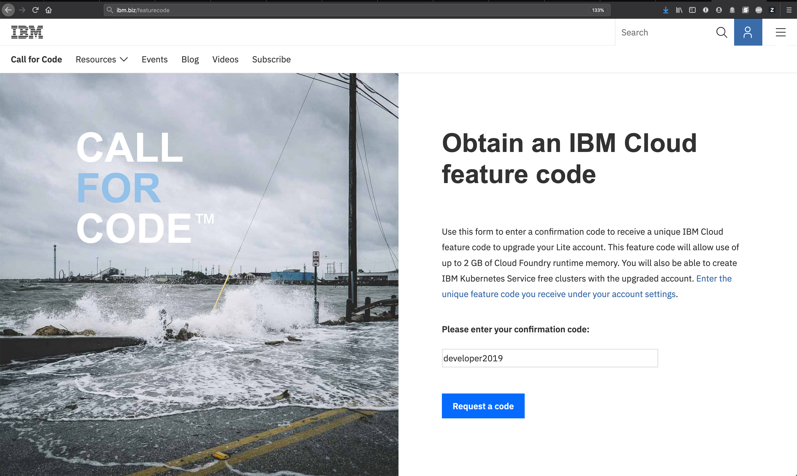)

2. Click **Request a Code** and copy the feature code returned 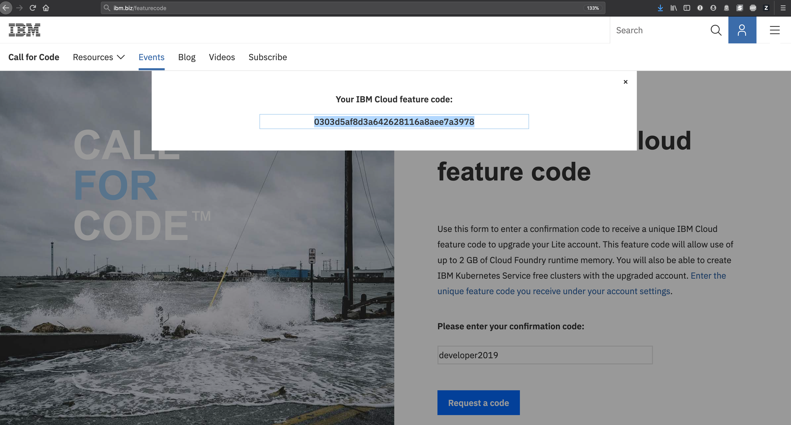

3. Apply the feature code to your Lite IBM Cloud account.  Go to your IBM Cloud account at [https://cloud.ibm.com](https://cloud.ibm.com) and select **Manage->Account** from the top right menu. 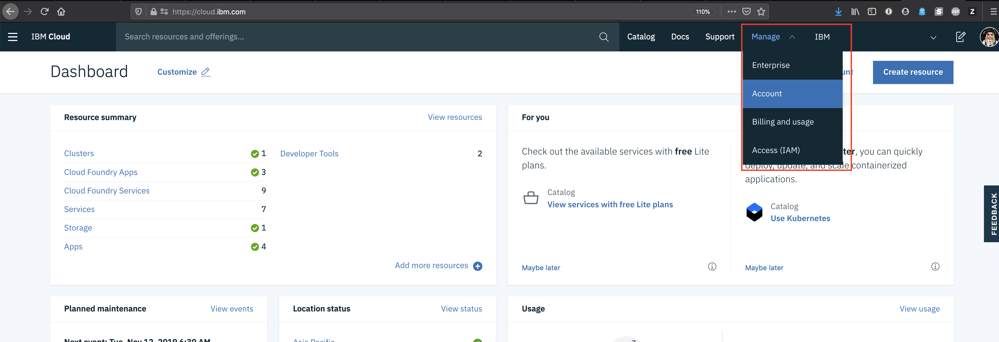

4. Within your Account page select **Account Settings** 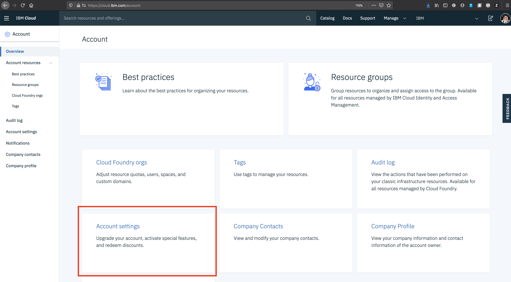

5. Within your Account Settings page select **Subscription and feature codes** 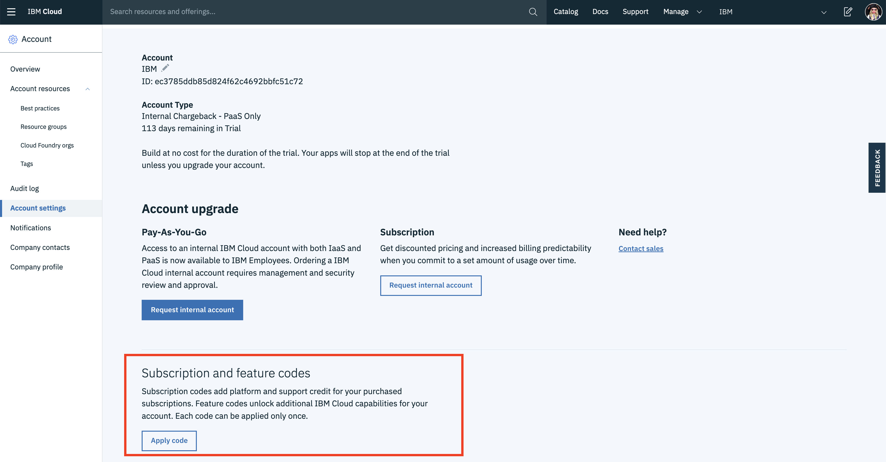

6. Apply your IBM Cloud Feature code 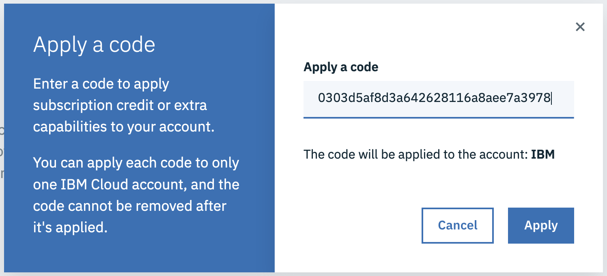

Congratulations!  You have now Converted your IBM Cloud Lite account to a trial account, have additional services available to you and can now create a managed IBM Cloud Kubernetes Cluster.  Continue to [Step 2: Create a Kubernetes Cluster](#step-2-create-a-kubernetes-cluster)

## Step 2: Create a Kubernetes Cluster

Duing Lab 2 portion of the *Digital Developer Conference: AI & Cloud* you will be utilizing a Kubernetes Cluster to deploy a web application.  Once you have created a managed Kubernetes Cluster it will take 10 minutes to complete deployment and be ready for the final Lab portion of this conference. 

1. Go back to your IBM Cloud Dashboard at [https://cloud.ibm.com](https://cloud.ibm.com) and seclect the Catalog of services available on the IBM Cloud. 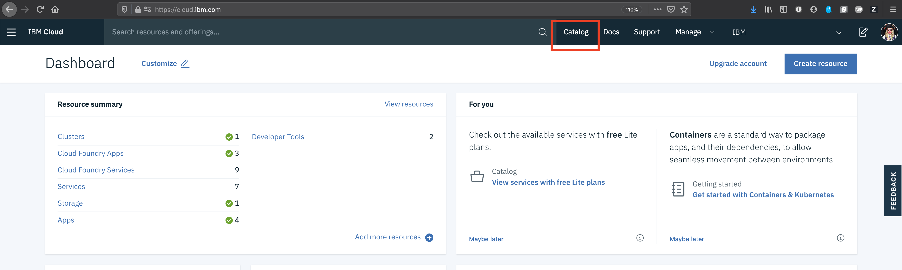

2. IBM Cloud Catalog includes all the services available to you. From this [catalog page](https://cloud.ibm.com/catalog) click on  **Kubernetes Service**.  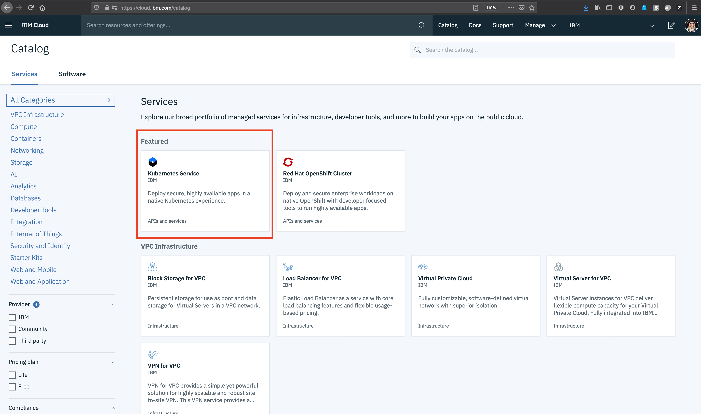

3. Here you see an overview of IBM's Managed Kubernetes Offerings, and several helpful links.  Continue custer creation by clicking **Create** 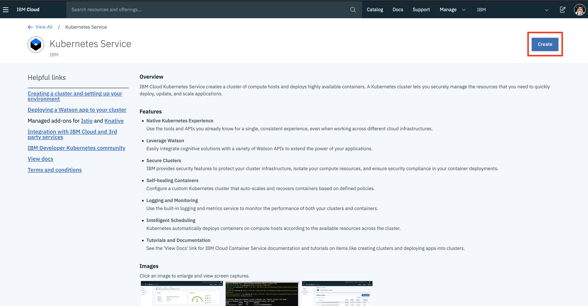 

4. The next page during Kubernetes Cluster creation is asking for more infromation about the type of Kubernetes Cluster you are creating and name.  Note as this is built from upstream OpenSource Kubernetes you will see the Kubernetes version that is being deployed. Select the **Free** plan, keep the default cluster name `mycluster` and click **Create** to begin the cluster creation process.
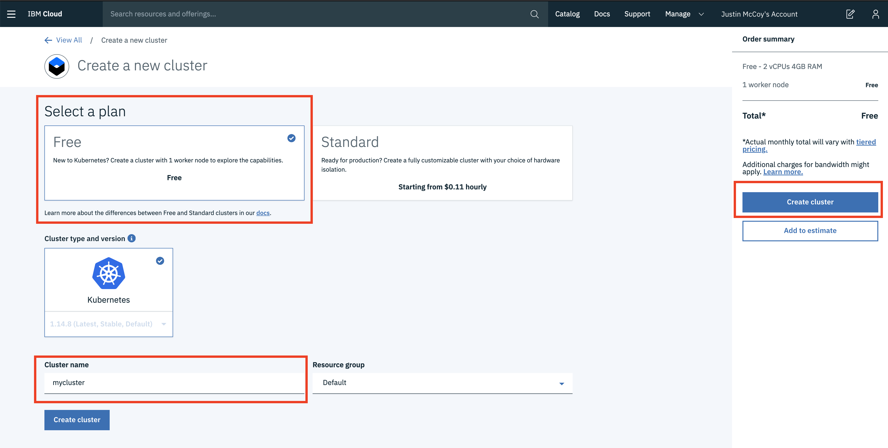

5. You have now created a managed Kubernetes Cluster, it will take up to 10 minutes to complete provisioning. Monitor the creation process from this page. On this final page you are given instructions for configuring your environment to connect to the Kubernetes cluster, Wait as we will go through this portion in more detail later in Lab 2.  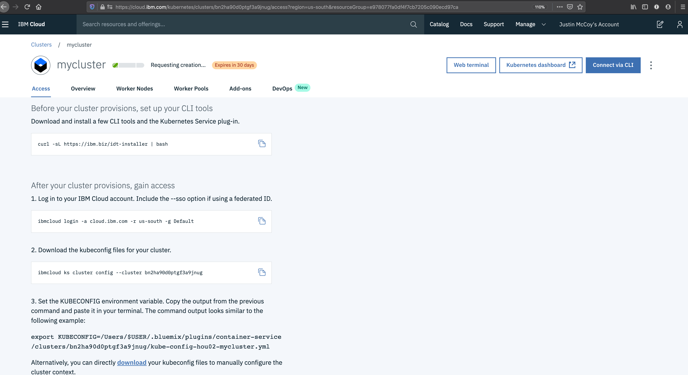

### Congratulations!! You have completed Lab 1 and are ready to move forward with the remainder of the Digital Developer Conference: AI & Cloud

## Helpful Links

* [IBM Cloud Kubernetes Service](https://cloud.ibm.com/kubernetes/catalog/cluster)
* [Request Feature Code](https://ibm.biz/featurecode)
* [Creating a cluster and setting up your environment](https://cloud.ibm.com/docs/containers?topic=containers-cs_cluster_tutorial#cs_cluster_tutorial)
* [Deploying a Watson app to yur cluster](https://cloud.ibm.com/docs/containers?topic=containers-cs_apps_tutorial#cs_apps_tutorial)
* [ISTIO Addon](https://cloud.ibm.com/docs/containers?topic=containers-istio#istio)
* [KNative Addon](https://cloud.ibm.com/docs/containers?topic=containers-knative_tutorial#knative_tutorial)
* [Managed Kubernetes Documentation](https://cloud.ibm.com/docs/containers?topic=containers-getting-started)
